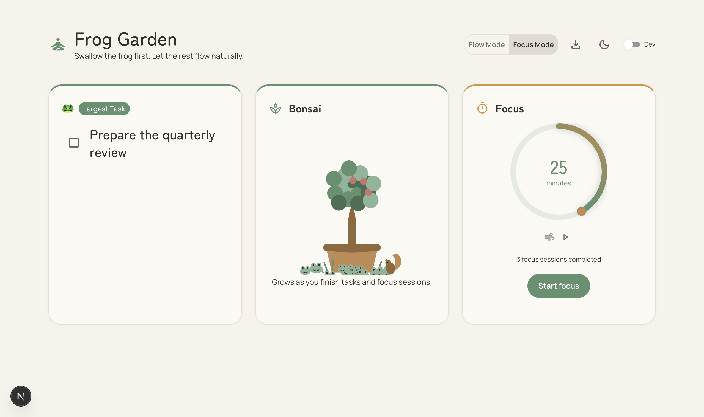
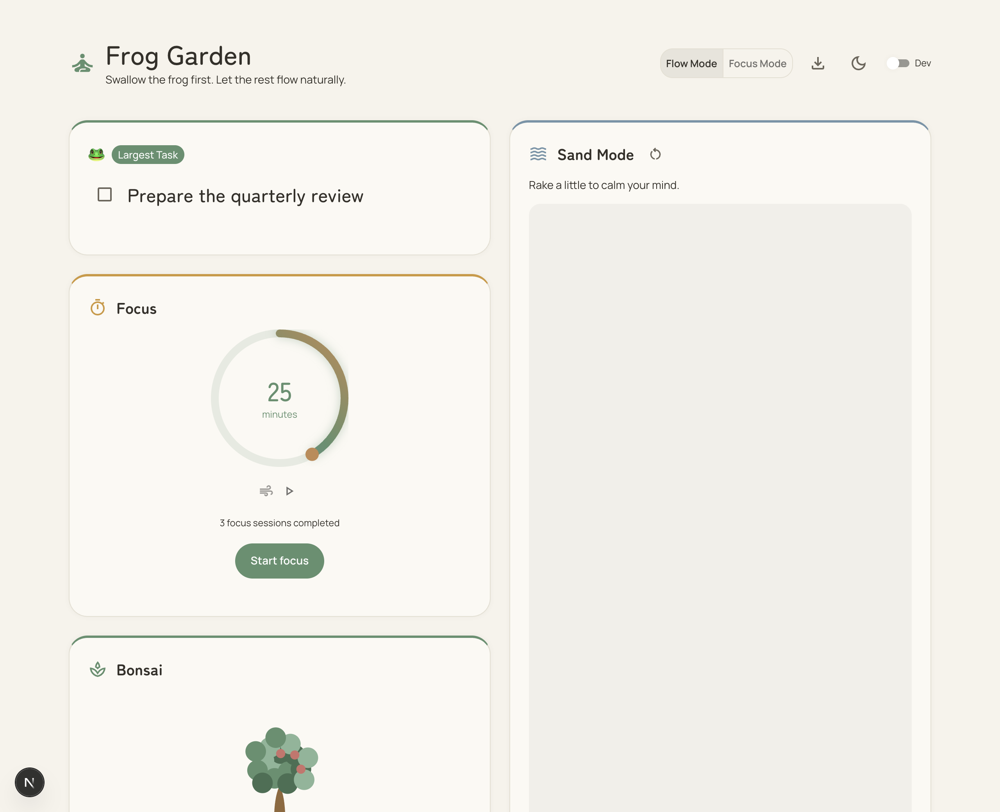
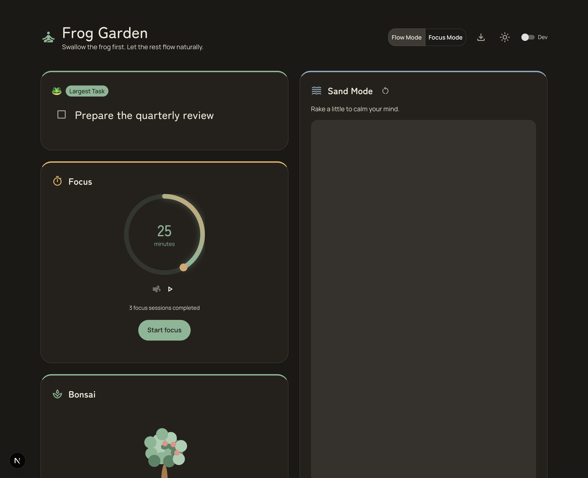

# 🐸 Frog Garden

A calm, Zen/Tao-influenced to-do app that turns getting things done into tending a small garden. Swallow your **frog** (the biggest task) first, let the rest flow, and watch a bonsai grow — with a few frog friends gathering along the way.

Progress is rewarded organically — a growing tree, a gathering of frogs, the occasional squirrel — never scoreboards, streaks, or guilt. Everything lives **on your device**; there's no account, no backend, and no tracking.



## Screenshots

| Flow Mode (light) | Flow Mode (dark) |
| --- | --- |
|  |  |

## Highlights

- **Swallow the frog first** — pick the day's largest task; it gets its own calm, front-and-center card.
- **Flow Mode & Focus Mode** — a full Bento dashboard, or a stripped-down view of just the frog, the timer, and the bonsai.
- **A growing bonsai** — finishing tasks and focus sessions grows the tree through the day; it gently wilts during idle daytime hours and recovers the moment you get back to it. Purely visual — no numbers.
- **Frog friends** — each completion brings more frogs to the base of the pot (the frog task most of all), up to a calm little colony, with a squirrel that stops by now and then.
- **Focus timer** — a quiet Pomodoro-style dial with an optional synthesized nature-sound loop.
- **Sand Mode** — a raked-sand canvas to fidget with; smooth it anytime, and it clears with each new day.
- **Start a new day** — archive the day (completed tasks, notes, reflection, focus count, bonsai growth) and begin fresh; unfinished tasks carry over.
- **Local JSON export** — download any single archived day or your whole history as JSON, entirely offline. Your data is never locked in.
- **Celebrations** — a ribbon flourish when you swallow the frog, confetti for everything else.
- **Accessible & calm** — keyboard-operable, screen-reader labelled, WCAG-AA contrast in light and dark, and full `prefers-reduced-motion` fallbacks.

## Tech

- [Next.js](https://nextjs.org) (App Router) + React + TypeScript
- [Material UI](https://mui.com), heavily re-themed into a muted, nature-inspired palette
- [Framer Motion](https://www.framer.com/motion/) for restrained, organic motion, and [lottie-react](https://lottiefiles.com/) for the completion celebrations
- Persistence via the browser's `localStorage` — **local-first, no server, no telemetry**

## Getting started

```bash
npm install
npm run dev
```

Then open [http://localhost:3000](http://localhost:3000).

## How it's built

Frog Garden is developed spec-first with [GitHub Spec Kit](https://github.com/github/spec-kit): every feature moves through specify → clarify → plan → tasks → analyze → implement → converge, and the resulting artifacts live under [`specs/`](specs/). The project's guiding principles — calm UX, subtle (non-scoreboard) gamification, local-first privacy, and non-negotiable accessibility — are recorded in [`.specify/memory/constitution.md`](.specify/memory/constitution.md).
